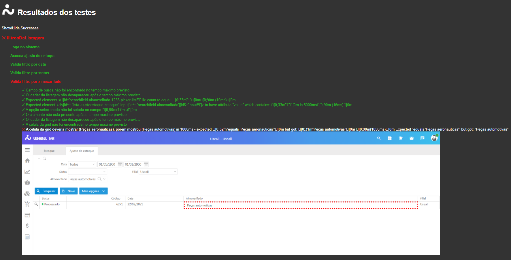

Métodos para automação de testes dos sistemas Useall 
 
Este framework conta com funções que permitem interagir com vários elementos e funcionalidades comuns para os sistemas da Useall.  
Além disso também estão disponíveis funções para interagir com a mensageria, presente em vários sistemas da Useall.  

A documentação completa pode ser consultada [aqui](https://cassiourugit.github.io/UseallTestFramework/)


## Pré-requisitos
* Nightwatch
* NodeJs
&nbsp;

Se você já tem um projeto de testes automatizado utilizando nightwatch, você já atende aos requisitos necessários para utilizar esse framework.

## Como instalar
Digite na linha de comando:

```
npm install usealltestframework
```

## Como configurar
Você deve inserir as seguintes linhas dentro do "module.exports" no seu arquivo "nightwatch.conf.js"
A linha terminada em "coreCommands" habilita as funções padrão para os sistemas da Useall.
A linha terminada em "msgCommands" habilita as funções para controle de elementos da mensageria.

```
    custom_commands_path: [
        "node_modules/usealltestframework/js/coreCommands",
        "node_modules/usealltestframework/js/msgCommands"
    ],

```


Criar na raíz do projeto de testes um arquivo chamado "usealltestframework.conf.js"  
Esse é o arquivo de configuração do framework.  
Ele pode ser configurado da seguinte forma:

```
module.exports = {
    destaca_elemento: true
};

```

  
Essa configuração irá habilitar o recurso de destacar elementos caso o teste encontre divergências entre o que era espero e o que foi encontrado.  
Para desabilitar este recurso, basta setar a configuração como "false".  
  
As funções do core que utilizam este recurso são:  
```
acessaMenu
pesquisaDocumentos
setaSearchfield
validaRegistroCampoTexto
validaRegistroCelulaGrid
```
## Como utilizar as funções
Após a instalação e configuração do framework, para utilizar as funções basta chamá-las a partir do comando "browser" ou "client", como se fossem funções do próprio Nightwatch.
&nbsp;

Veja o exemplo abaixo, onde será chamada a função que vai buscar o "João da Silva" em um campo de busca qualquer:

```
browser.setaSearchfield("localizadorDoCampo", "João da Silva")
```


## Utils
Esse framework também traz algumas funções que podem facilitar a criação de alguns testes. Existem funções geradoras de CPF e CNPJ, geradores de data com diversos formatos, geradoras de strings randomicas com determinados números de caracteres, entre outras.

Para utilizar esse recurso, basta seguir o exemplo abaixo no seu arquivo de teste

```
const util = require("usealltestframework/js/utils/util");
```
A linha acima instancia o pacote de funções no arquivo de teste. Agora, basta utilizar as funções dessa forma:

```
var cpf = util.geraCpf();
var data = util.getData();
var stringCom4000Caracteres = util.geraString(4000);
```
&nbsp;

Você pode conferir todas as funções disponíveis no menu "Utils".


## Comparador de PDF

Este pacote permite baixar arquivos PDF gerados pelo sistema, que serão comparados com modelos préviamente salvos.  
Os pdf´s serão convertidos em imagens e um processo de comparação irá destacar as diferenças encontradas.  

Essa funcionalidade precisa dos seguintes pacotes e arquivos para funcionar:  
Pacotes NPM:  
```
"blink-diff": "^1.0.13"  
"pdf2img": "^0.5.0"  
```

E das seguintes aplicações instaladas no sistema operacional onde o teste vai rodar:  
```
GraphicsMagick na versão 13.34 Q16 64-bit  
GPL Ghostscript 64-bit  
XpdfReader 64-bit
```


## Html reporter

Agora, a ferramenta que gera os resultados dos testes em HTML já está integrada ao usealltestframework.

Para utilizá-la basta adicionar as seguintes linhas de configuração no arquivo globals.js 
```
const fs = require('fs');
const path = require('path');
const HtmlReporter = require('./node_modules/usealltestframework/report/nightwatch-html-reporter');
const reporter = new HtmlReporter({
    openBrowser: false,
    themeName: 'default',
    reportsDirectory: __dirname + '/reports'
});

if (!fs.existsSync(__dirname + '/reports')) {
    fs.mkdirSync(path.join(__dirname, '/reports'));
    console.log("Diretório dos relatórios criado com sucesso!");
}

if (!fs.existsSync(__dirname + '/reports/Diff')) {
    fs.mkdirSync(path.join(__dirname, '/reports/Diff'));
    console.log("Diretório das imagens Diff criado com sucesso!");
}

module.exports = {
    reporter: reporter.fn,
};
```
A propriedade "openBrowser" define se o relatório dos testes será exibido automaticamente em uma aba do navegador após a execução. Por padrão essa funcionalidade vem desabilitada

Segue abaixo um exemplo de como fica um relatório utilizando esse recurso:



## Construído com:
* [Nighwatch](https://nightwatchjs.org/) - Framework de automação de testes
* [Npm](https://www.npmjs.com/) - Gerênciador de pacotes javascript
* [Np](https://github.cyeisom/sindresorhus/np#readme) - Ferramenta para controlar o versionamento e a publicação de pacotes npm
* [JSDocs](https://jsdoc.app/) - Ferramenta de documentação
* [Better-Docs](https://github.com/SoftwareBrothers/better-docs) - Plugin para personalizar documentações do JSDocs
* [Nightwatch-html-reporter](https://github.com/jls/nightwatch-html-reporter) - Ferramenta que gera os relatórios de teste em HTML

## Author
**Cássio Benincá**